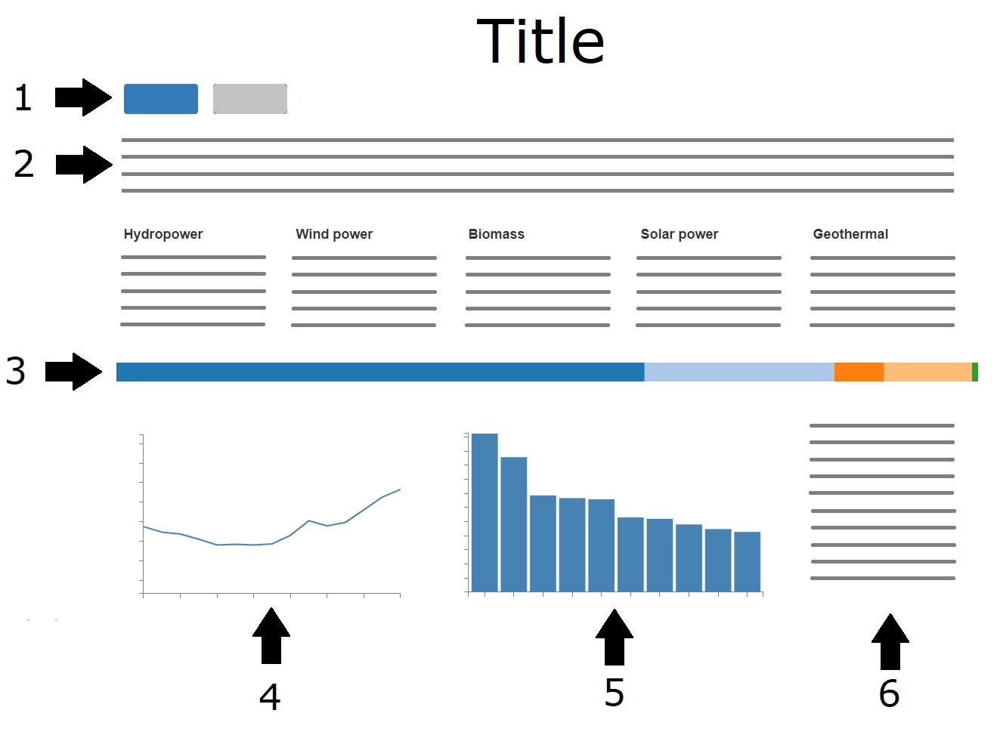

# Programmeerproject

Link to project: [index.html](https://berendnannes.github.io/Programmeerproject/index.html)

Het doel van dit project is om te laten zien hoe het er in de wereld voor staat met de productie van groene energie. Wordt er veel groene energie geproduceerd vergeleken met andere vormen van energie? Neemt dit toe of af? Om dit te beantwoorden wordt een interactieve wereldkaart gevisualiseerd waarop voor verschillende landen te zien is welk deel van hun totale energieproductie uit groene energie bestaat. Bij het klikken op een land wordt in kaart gebracht hoe groot de bijdrage is van verschillende soorten groene energie (zoals zonne- of windenergie) en hoeveel groene energie er in de afgelopen 15 jaar geproduceerd is ten opzichte van de totale energieproductie. Op de voorpagina moet een overzicht getoond worden waarin er en overzicht is voor de hele wereld..

De visualisatie bestaat dus uit twee pagina's:

### Mainpage (index.html)

1. ***Navigatie*** om te schakelen tussen de twee pagina's

2. ***Introductie***. Hierin wordt het onderwerp en het doel van de visualisatie geïntroduceerd.

3. ***Stacked bar***. In de horizontal stacked bar representeren de afzonderlijke bars verschillende soorten groene energie. Hoe groter de bar, hoe groter de bijdrage aan de totale groene energieproductie.
Bij mouseover zal de bar gehighlight worden en zal er informatie verschijnen over die energiebron.

4. ***Lijngrafiek***. In de lijngrafiek is weergegeven hoe de groene energieproductie in de wereld sinds 2000 is toegenomen (of afgenomen).

5. ***Extra storytelling***. waarin informatie wordt gegeven over twee landen die opvallend veel groene energie produceren.

Over energie en milieu worden veel visualizaties gemaakt met behulp van een wereldkaart, maar die belichten vaak maar één aspect tegelijk. De bedoeling van dit project is om op één scherm meerdere aspecten van één onderwerp, groene energie, uit te lichten.