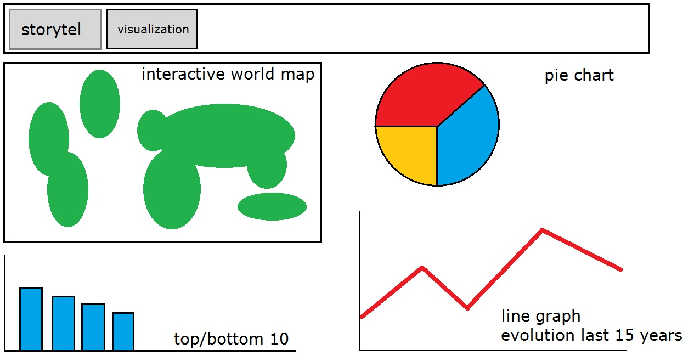

# Programmeerproject

Het doel van dit project is om te laten zien hoe het er in de wereld voor staat met de productie van groene energie. Wordt er veel groene energie geproduceerd vergeleken met andere vormen van energie? Neemt dit toe of af? Om dit te beantwoordenwordt een interactieve wereldkaart gevisualiseerd waarop voor verschillende landen te zien is welk deel van hun totale energieproductie uit groene energie bestaat. Bij het klikken op een land wordt in kaart gebracht hoe groot de bijdrage is van verschillende soorten groene energie (zoals zonne- of windenergie) en hoeveel groene energie er in de afgelopen 15 jaar geproduceerd is ten opzichte van de totale energieproductie. Tot slot wordt een overzicht gemaakt door middel van een top-10 van landen die het meeste of de minste groene energie produceren en de landen die het meest zijn gestegen qua productie.
De visualisatie bestaat dus uit de volgende onderdelen:
* D3 Datamap. Een overzicht van de landen in de wereld en hun groene energieproductie
* D3 Pie chart. Welke verschillende soorten groene energie worden geproduceerd en hoeveel?
* D3 Line graph. Is de productie in de afgelopen 15 jaar gestegen of juist gedaald?
* D3 Barchart. Welke landen presteren het best of het slechtst?

