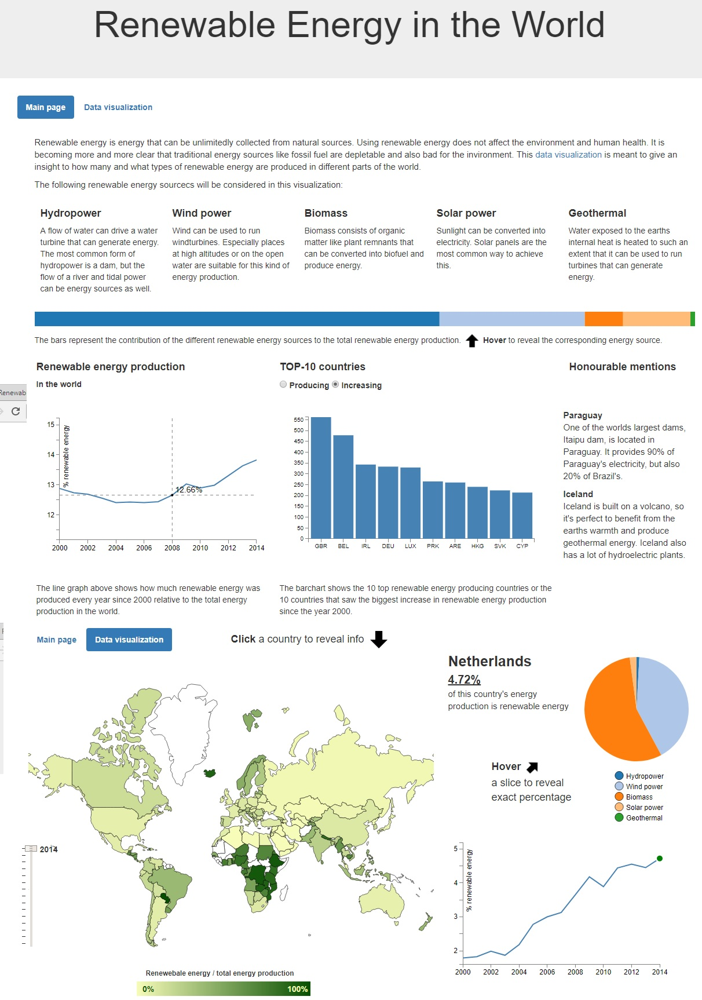

# Report

Deze visualisatie gaat over duurzame (groene) energie. Het doel van het project is om een overzicht te geven over hoeveel duurzame energie wordt geproduceerd in vergelijking met de totale energieproductie. Verder moet duidelijk worden welke soorten
groene energie voornamelijk een bijdrage leveren aan de totale groene energieproductie. Daarnaast geeft de visualisatie inzicht over of de groene energieproductie in de wereld en in de afzonderlijke landen is toegenomen of afgenomen.

